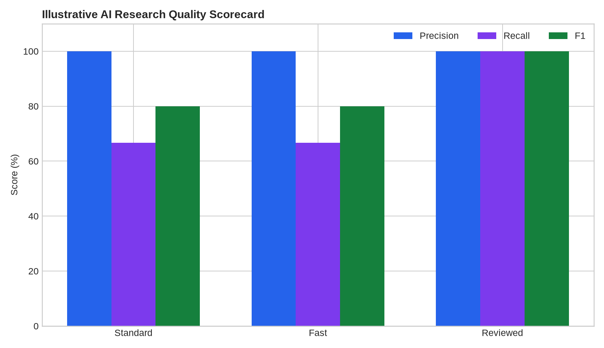
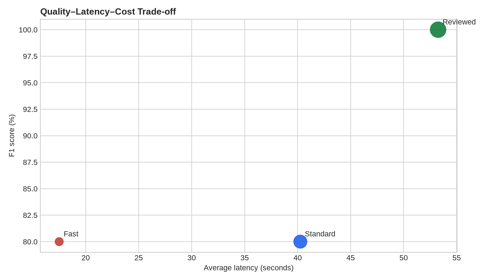

# AI Research Evaluation System

> Evaluation harness for AI-assisted research workflows using accuracy, completeness, consistency, traceability, latency, and cost metrics.

## Business Problem

A strong-looking AI answer is not sufficient evidence that a research workflow is reliable. The workflow should be evaluated against explicit expectations and documented failure modes.

## Analytical Questions

- How accurate are generated claims?
- Which claim types fail most often?
- What completeness is lost under shorter workflows?
- What is the quality-versus-cost trade-off?
- Are outputs traceable to evidence?

## Deliverables

- Gold-standard evaluation set
- Claim-level precision/recall/F1
- Completeness and citation-coverage checks
- Latency/cost tracking
- Failure taxonomy
- Evaluation report

## Suggested Repository Structure

```text
ai-research-evaluation-system/
├── data/
├── notebooks/
├── src/
├── tests/
├── outputs/
├── README.md
└── requirements.txt
```

## Stack

Python, pandas, JSON, structured evaluation harness, pytest

## Method

1. Define the decision context and metric definitions.
2. Profile and validate the data.
3. Build reproducible transformations and calculations.
4. Quantify the main drivers, scenarios, or failure modes.
5. Validate outputs and document limitations.
6. Produce an executive-ready decision narrative.

## Portfolio Standard

Use synthetic or public data with documented provenance. Clearly distinguish measured results from assumptions and illustrative scenarios.

## Sample Outputs

Run `python src/generate_outputs.py` to reproduce the claim-level evaluation scorecard. The fixture uses synthetic labels and does not measure a deployed AI system.

### Executive summary

See [`outputs/executive_summary.md`](outputs/executive_summary.md) for the quality, latency, cost, and limitation notes.





- [`outputs/workflow_scorecard.csv`](outputs/workflow_scorecard.csv) — workflow-level metrics
- [`outputs/failure_taxonomy.csv`](outputs/failure_taxonomy.csv) — illustrative failure counts
